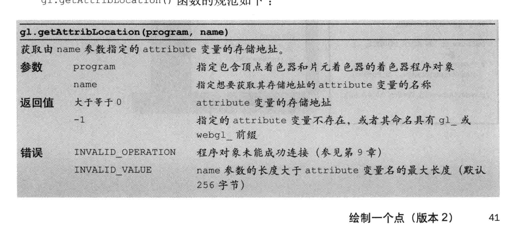

# 第二章 WebGL入门

## **WebGL程序**

以一些核心的webgl函数组成的javascript程序，称为WebGL程序，WebGL Application，是WebGL的基础入门之一，大部分的都以一些固定模板的代码入门，包括

- 获取canvas元素
- 引入WebGL Javascript文件
- WebGL绘图函数
- 着色器程序
- ...


## **Canvas**

早期网页上只能显示静态图片，后来出现了Flash Player，HTML5引入了\<canvas\>标签，允许我们使用Javascript，通过调用canvas提供的绘图函数来绘制点、线、矩形、圆等。


[示例代码，例2.1 DrawingRectangle.html，具体理解点击打开DrawRetangle.js](./src/DrawingRectangle.html)

运行以上代码能看到一个蓝色的矩形绘制在网页中

canvas的坐标系统


------

## **开始入门WebGL程序**


先看看清空绘图区的效果，清空了canvas的矩形区域


[示例代码,HelloCanvas.html, 具体理解点击打开HelloCanvas.js](./src/HelloCanvas.html)


**gl.clear(buffer)的参数类型和默认值**


## **使用WebGL绘制一个点**

[示例代码,HelloPoint1.html, 具体理解点击打开HelloPoint1.js](./src/HelloPoint1.html)

与上一段练习差别不大，就是多了两个着色器程序，可以先抄着实现出来，后面再详细看

## **着色器**

先了解整体从js执行到webgl系统绘制的流程


为什么要使用着色器，在真正的三维绘图中，不可能只靠线条和颜色就能把图形画出来，还需要考虑很多光线，观察者视角变化，颜色自然过渡等，着色器可以高度灵活的完成这些工作。

**着色器的分类**

WebGL需要两种着色器

- **顶点着色器**
    
    用来描述顶点的特性，位置，颜色等

- **片元着色器**

    在WebGL中，可以将片元理解为像素

    进行逐片元（像素）的处理，例如光照，颜色等


按照个人理解，在实际用途中，一个用于处理顶点，一个用于处理顶点之间的的插值等，用处很多，后续根据文章再学习


**着色器语言和着色器初始化着色器**

先看看HelloPoint1.js中的着色器相关的代码


着色器使用的是类C的OpenGL ES着色器语言，这里与书中不同的是，没有使用\n换行符，因为用的是字符串插值的反引号，与使用单引号的方式不同，有js基础的应该可以理解

mian函数的执行流程


在写完着色器后，通过**initShaders()**函数对着色器进行初始化，函数定义在cuon.util.js中，第九章会研究内部细节

initShader函数的接口和返回，函数主要做的事就是将着色器代码传给WebGL系统


当前学习进度中，暂时只需要知道，WebGL程序包括运行在浏览器的js和运行在WebGL系统的着色器程序两部分

**顶点着色器**

顶点着色器的组成

```
var vertex_shader_source = `
    void main()  // 必须包含main函数且不能指定参数
    {
        gl_Position = vec4(0.0, 0.0, 0.0, 1.0); // 顶点位置，且必须被赋值
        gl_PointSize = 10.0; // 点的尺寸大小（像素），默认0.1
    }
`
```

顶点着色器也使用 = 操作符为变量赋值，GLES ES是一种强类型的语言，需要开发者指明数据的类型，系统能理解变量中存储的类型，便于优化。


**片元着色器**

```
// 片元着色器程序，后面GLSL ES章节会详细说
var fragment_shader_source = `
        void main(){
            gl_FragColor = vec4(1.0,0.0,0.0,1.0); // 指定片元颜色，RGBA格式
        }
`;
```

其余部分与顶点着色器差不多，看书参考一下即可

## **绘制操作**

gl.drawArrays()函数，用来绘制各种图形的

函数接口


## WebGL坐标系统

使用的是三维坐标系统，具有x,y,z三个轴，面向计算机屏幕，正右方向是x轴，y轴正下方向，视线沿着屏幕中心点看过去是-z轴，这套坐标系也称为右手坐标系

game101系列视频也有介绍，canvas的坐标系，各个轴的取值范围都是[-1,1]，而WebGL坐标系则不是，需要有相应的映射，参考投影的相应视频能更好的理解这个映射。


# **绘制一个点（版本2）**

通过绘制一个点的版本2，学习js和着色器，着色器和着色器之间传输数据

有两种方式可以满足我们的需要

- attribute变量
    
    传输的是与顶点相关的数据，这些数据只有顶点着色器才能使用

- uniform变量

    传输的对所有顶点（或与顶点无关）的数据，类似于全局变量，谁都能用


**attribute变量**

是一种GLSL ES变量，用于从外部向顶点着色器传输数据，只有顶点着色器能使用

**使用attribute变量的步骤**

- 在顶点着色器，声明attribute变量
- attribute变量赋值给gl_Position变量
- 向attribute变量传输数据

**代码重点说明**

[示例代码,HelloPoint2.html](./src/HelloPoint2.html)

新增与修改的代码已用红线标出


关键词attribute也称为**存储限定符**，attribute变量的声明由以下下格式组成，约定所有attribute变量名均以a_前缀开始，uniform变量则以u_前缀开始，后续将不再解释（也可以自己命名，不强制要求）

```
// 存储限定符    类型   变量名
   attribute   vec4   a_Position
```


initShader() 函数执行后，会生成一个程序对象program object，它包括了顶点着色器和片元着色器，通过gl.program即可获取到， 再通过gl.getAttribLocation函数就可以获取到a_Position的地址



```
gl.getAttribLocation(gl.program, 'a_Position')
```

最后通过gl.vertexAttrib3f()函数将顶点位置数据传给attribute变量


```
// 回想一下x,y,z在canvas坐标系中最大值和最小值，可以尝试一下x，y大于1，小于-1的情形
gl.vertexAttrib3f(a_Position, 0.5, 0.5, 0.0);
```

**gl.vertexAttrib3f()同族函数**

查看书籍自行练习一下即可，可以通过复制一份HelloPoint2.html和HelloPoint.js，然后修改测试

[示例代码,gl_vertexAttrib3f_pratice.html](./src/gl_vertextAttrib3f_pratice.html)

示例代码在js文件的38行开始，可以自行替换看看效果


## **鼠标绘制-uniform变量小节综合练习**

通过前面的综合练习，在有js基础的前提下，对剩余部分的内容已经有一定把握了，直接弄一个综合性的练习，不懂的地方再查书

[示例代码,comprehensive_exercises.html](./src/comprehensive_exercises.html)


