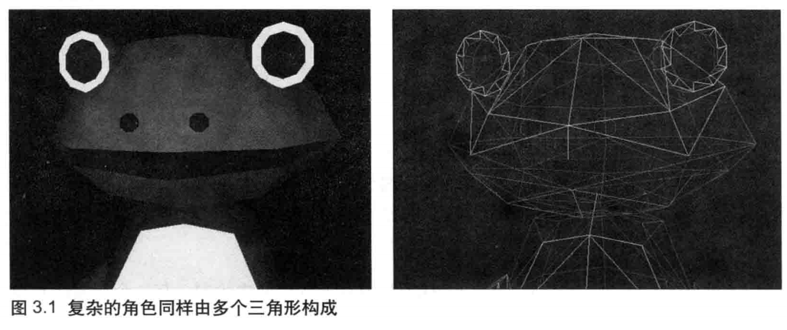
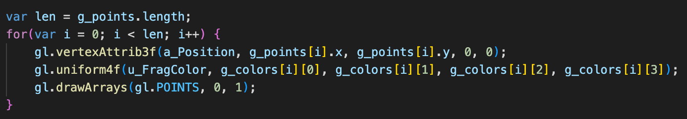
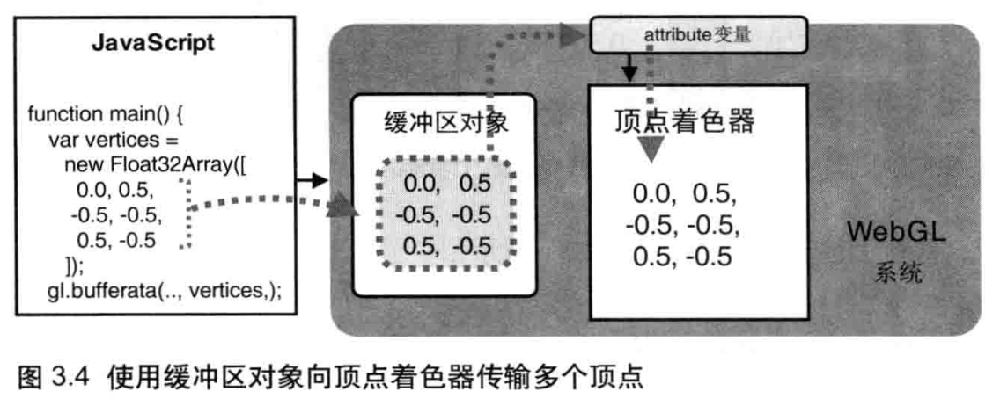
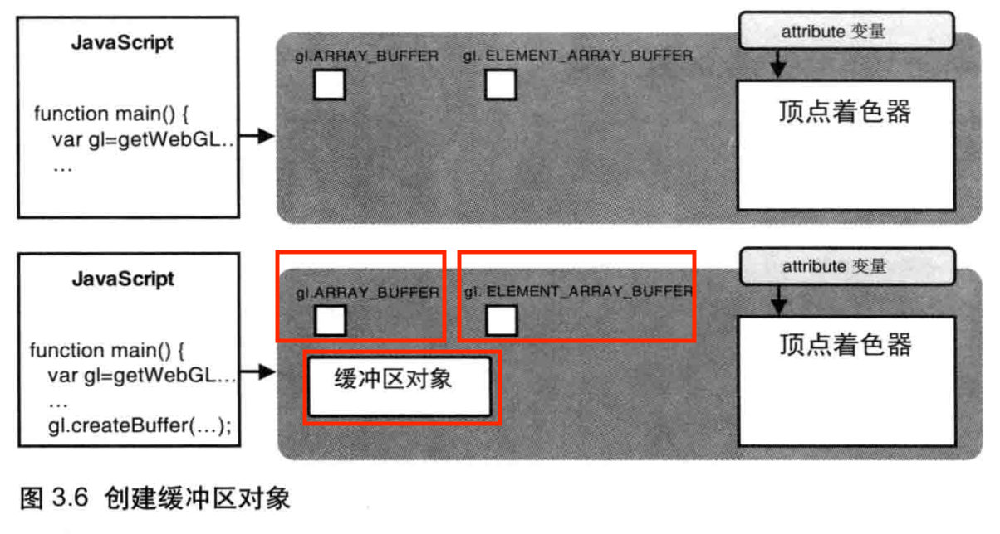
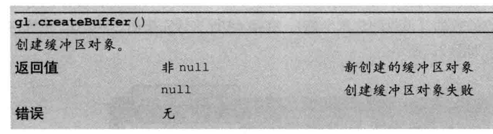
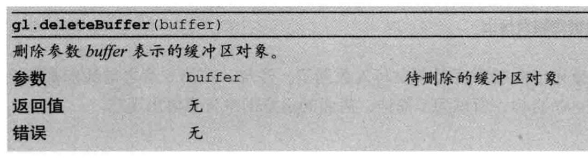
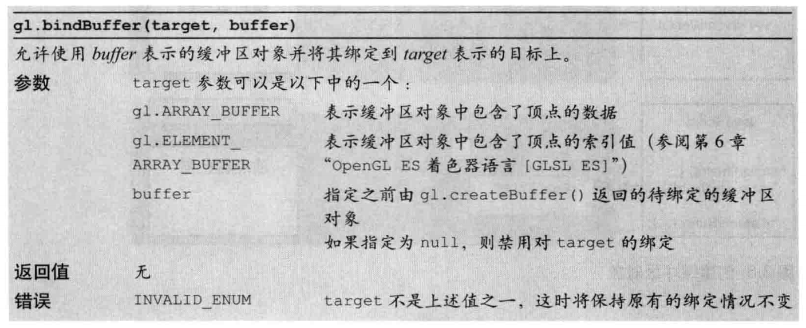
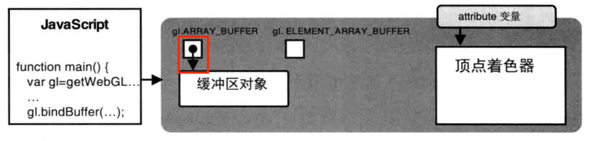

# 第三章 绘制和变换三角形

## **本章主要内容**

- 三角形在三维图形学中的重要地位，以及WebGL如何绘制三角形
- 使用多个三角形绘制其他基本图形
- 三角形的基本变换
- 利用矩阵简化变化

## **绘制多个点**

学习绘制三角形的原因：很多复杂的图像由多个三角形组成的，绘制多个点是绘制三角形的基础

第二章最后的绘制多个点的综合练习中，通过for()循环，每遍历一次就向着色器传入一个点，并调用gl.drawArrays()绘制出来，但是有个弊端，这个方法遍历一次画一个点。

为了解决这个弊端，WebGL提供了方便的机制，称为**缓冲区对象**，可以一次性向着色器传入多个顶点的数据。

缓冲区对象是WebGL系统中的一块内存区域，可以一次性的向缓冲区对象填充大量的顶点数据，并保存起来供着色器使用。

先通过浏览示例程序有个总体印象，代码中没有什么变化的地方没有作注释，有变化的地方均加了注释，先通过示例代码有个大体印象

[示例代码：MutilPoint.js](./src/MutilPoint.js)

## **使用缓冲区对象**

使用缓冲区对象的流程，搭配MultiPoint.js示例代码和下图加深印象

**使用缓冲区对象向顶点着色器传入多个顶点数据的流程**

- 创建缓冲区对象 gl.createBuffer()

     MultiPoint.js 58行

- 绑定缓冲区对象 gl.bindBuffer()

     MultiPoint.js 64行

- 将数据写入缓冲区对象 gl.bufferData()

     MultiPoint.js 68行

- 将缓冲区对象分配给一个attribute对象 gl.vertexAttribPointer()

     MultiPoint.js 73行

- 开启attribute变量 gl.enableVertexAttribArray()

     MultiPoint.js 76行

## **以上每一步的具体细节**

**gl.createBuffer()函数， 创建缓冲区对象**

在创建initShaders()成功后，调用gl.createBuffer()函数来创建缓冲区对象。

执行函数的结果是WebGL系统中多了一个新创建出来的缓冲区对象

下图分别是创建前和创建后的对比，当中涉及到的关键词gl.ARRAY_BUFFER和gl.ELEMENT_BUFFER会在下一节解释

函数规范

相应的，有创建就会有删除，gl.deleteBuffer(buffer)函数，看看函数规范了解一下即可，什么时候要删除缓冲区对象是要看开发需求的

**gl.bindBuffer()函数，绑定缓冲区**

gl.bindBuffer()函数的作用是将缓冲区对象绑定到WebGl系统中已存在的“目标”(target)。这个target，表示缓冲区对象的用途，在MultiPoint.js里面就是提供传给attribute变量的数据。

函数规范

在示例程序中将缓冲区对象绑定到了gl.ARRAY_BUFFER目标，缓冲区对象存储着顶点的数据，执行完毕后，WebGL系统内部状态发生变化

接下来就可以向缓冲区写入数据，gl.ELEMENT_ARRAY暂未用到，示意图先不显示

