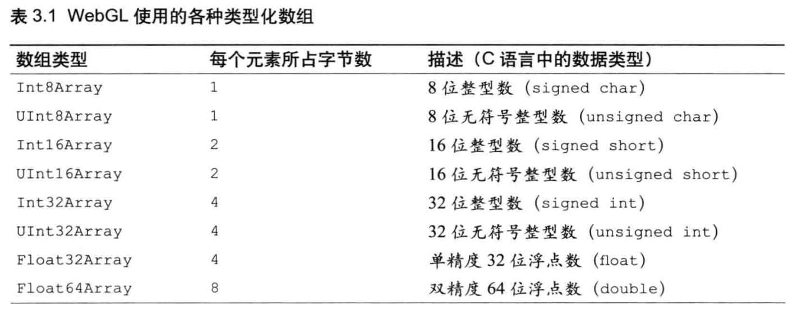
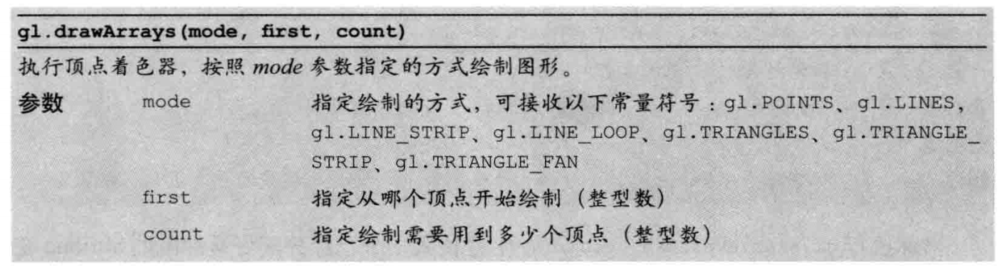

# 第三章 绘制和变换三角形

## **本章主要内容**

- 三角形在三维图形学中的重要地位，以及WebGL如何绘制三角形
- 使用多个三角形绘制其他基本图形
- 三角形的基本变换
- 利用矩阵简化变化


## **绘制多个点**

学习绘制三角形的原因：很多复杂的图像由多个三角形组成的，绘制多个点是绘制三角形的基础


第二章最后的绘制多个点的综合练习中，通过for()循环，每遍历一次就向着色器传入一个点，并调用gl.drawArrays()绘制出来，但是有个弊端，这个方法遍历一次画一个点。


为了解决这个弊端，WebGL提供了方便的机制，称为**缓冲区对象**，可以一次性向着色器传入多个顶点的数据。

缓冲区对象是WebGL系统中的一块内存区域，可以一次性的向缓冲区对象填充大量的顶点数据，并保存起来供着色器使用。

先通过浏览示例程序有个总体印象，代码中没有什么变化的地方没有作注释，有变化的地方均加了注释，先通过示例代码有个大体印象

[示例代码：MutilPoint.js](./src/MutilPoint.js)

## **使用缓冲区对象**

使用缓冲区对象的流程，搭配MultiPoint.js示例代码和下图加深印象


**使用缓冲区对象向顶点着色器传入多个顶点数据的流程**

- 创建缓冲区对象 gl.createBuffer()

     MultiPoint.js 58行

- 绑定缓冲区对象 gl.bindBuffer()

     MultiPoint.js 64行

- 将数据写入缓冲区对象 gl.bufferData()

     MultiPoint.js 68行

- 将缓冲区对象分配给一个attribute对象 gl.vertexAttribPointer()

     MultiPoint.js 73行

- 开启attribute变量 gl.enableVertexAttribArray()

     MultiPoint.js 76行


## **以上每一步的具体细节**

**gl.createBuffer()函数， 创建缓冲区对象**

在创建initShaders()成功后，调用gl.createBuffer()函数来创建缓冲区对象。

执行函数的结果是WebGL系统中多了一个新创建出来的缓冲区对象

下图分别是创建前和创建后的对比，当中涉及到的关键词gl.ARRAY_BUFFER和gl.ELEMENT_BUFFER会在下一节解释


函数规范


相应的，有创建就会有删除，gl.deleteBuffer(buffer)函数，看看函数规范了解一下即可，什么时候要删除缓冲区对象是要看开发需求的


**gl.bindBuffer()函数，绑定缓冲区**


gl.bindBuffer()函数的作用是将缓冲区对象绑定到WebGl系统中已存在的“目标”(target)。这个target，表示缓冲区对象的用途，在MultiPoint.js里面就是提供传给attribute变量的数据。

函数规范


在示例程序中将缓冲区对象绑定到了gl.ARRAY_BUFFER目标，缓冲区对象存储着顶点的数据，执行完毕后，WebGL系统内部状态发生变化


接下来就可以向缓冲区写入数据，gl.ELEMENT_ARRAY暂未用到，示意图先不显示

**gl.bufferData() 向缓冲区对象写入数据**

```
gl.bufferData(gl.ARRAY_BUFFER, vertices, gl.STATIC_DRAW)
```

第二个参数vertices数据写入缓冲区对象，我们不能直接向缓冲区对象写入数据，必须通过gl.bindBuffer()将缓冲区对象绑定到gl.ARRAY_BUFFER，然后再调用gl.bufferData()去写入数据

执行结束时WebGL系统内部状态


函数规范


我们在定义vertices的时候并没有使用常见的Javascript中的Array对象，Array对象是一种通用的类型，并没有对“大量元素都是同一种类型”的情况进行优化，所以WebGL引入了**类型化数组**，Float32Array是其中之一

```
var vertices = new Float32Array([0.0, 0.5, -0.5, -0.5, 0.5, -0.5]);
```

**类型化数组**

使用类型化数组的目的在于WebGL在绘制图形时，通常需要处理大量相同类型的数据，例如顶点坐标或者颜色数据。

为了优化性能，WebGl为每种基本数据类型引入了一种特殊的数组，称为**类型化数组**

各种可用的类型化数组，也附上C语言对应的数据类型



与js的Array相似，类型化数组也有一系列的方法和属性（包括一个常量属性），但是类型化数组不支持push和pop，创建类型化数组的唯一方式是**使用new运算符**，创建的时候既可以向构造函数传入普通数组，也可以只传入数据元素个数来创建一个空的类型化数组

```
var vertices = new Float32Array([0.0, 0.5, -0.5, -0.5, 0.5, -0.5]);

var vertices = new Float32Array(4);
```

类型化数组的方法、属性和常量


**gl.vertexAttribPointer() 将缓冲区对象分配给attribute变量**

在第二章时使用了gl.vertextAttrib[1234]f系列同组函数来为attribute变量赋值，但这个方法一次只能分配一个值。所以，WebGl系统提供gl.vertexAttribPointer()，可以一次性将整个缓冲区对象（引用或指针）分配给attribute变量。

函数规范


**gl.enableVertexAttribArray() 开启attribute变量**

执行gl.enableVertexArray()后，顶点着色器才能访问到缓冲区的数据，函数实际上处理的对象是缓冲区。

函数规范


分配了缓冲区的attribute变量也可以使用gl.disableVertexAttribArray()函数来关闭分配，函数规范如下


当顶点着色器运行，会自动将缓冲区中的顶点画出来。

有一点需要注意的，开启attribute变量后，不能再使用gl.vertexAttrib[1234]f函数向attribute变量传输数据，除非显式的关闭了该变量。

**gl.drawArrays()**

最后调用gl.drawArrays()去执行顶点着色器。

函数规范



让我们关注gl.drawArrays()第二个first和第三个参数count，当执行这个函数时，实际上顶点着色器执行了3次，着色器会根据提供的第二和第三个参数去执行。

对于外部调用者，这属于着色器的内部细节，外部调用者只要提供符合着色器需要的数据即可。

```
first = 0 // 从缓冲区第1个坐标开始画起
count = 3 // 准备绘制3个点
``` 

先回顾一下gl.vertextAttribPointer()的函数规范，再对比MultiPoints.js的73行中的代码

```
// 顶点
var vertices = new Float32Array([0.0, 0.5, -0.5, -0.5, 0.5, -0.5]);
......
// 缓冲区对象分配给a_Position
gl.vertexAttribPointer(a_Position, 2, gl.FLOAT, false, 0, 0);
```

我们在vertices中提供了三个顶点的x，y，但是z并没有提供，并且在着色器中，attribute变量是vec4类型，缺少的分量是如何补齐的？

gl.vertexAttribPointer()函数的第二个参数设置为2，它表示缓冲区中每个顶点有几个分量值，z和w分量会被自动设为0.0或1.0.


顶点着色器执行过程中缓冲区数据的传输过程如下图所示


**基于MultiPoint的实验**

实验程序已经给了一些基本示例，可以自行修改测试


[示例程序：ExperimentBaseOnMultiPoint](./src/ExperimentBaseOnMultiPoint.js)


## **Hello Triangle**

[长呼一口气.jpg] 终于进到画三角形了

基于我们上一个练习MultiPoints里面学到的知识，绘制一个三角形，新的示例代码中，修改了两处地方

[示例代码：HelloTriangle](./src/HelloTriangle.js)

```
var vextex_shader_source = `
    attribute vec4 a_Position;
    void main() {
        gl_Position = a_Position;
        // gl_PointSize = 5.0; 这句可以删掉，这个只有在画点的时候才有作用
    }
`;
......
gl.drawArrays(gl.TRIANGLES, 0, n); // 将gl.POINTS修改为gl.TRIANGLES
......
```

我们将gl.POINTS修改为gl.TRIANGLES的作用是告诉顶点着色器，执行三次，用这三个顶点绘制一个三角形，这样缓冲区中的三个点不再是独立的，而是同一个三角形中的3个顶点

gl.drawArrays可以绘制的基本图形查看下表，这些基本图形也是绘制其他更加复杂图形的基础


**基于HelloTriangle的实验程序**

这个实验程序已经直接附在了HelloTriangle.js文件中，自行替换测试

测试绘制的同时，要对比上面表格中的描述，确保自己绘制对了


## **绘制矩形**

在上一节中学会了三角形的绘制，接下来绘制矩形，Webgl不支持直接绘制矩形，可以通过将其划分为两个三角形，再通过gl.TRIANGLES、gl.TRIANGLES_STRIP，或gl.TRIANGLES_FAN进行绘制。

使用gl.TRIANGLES_STRIP需要4个顶点，gl.TRIANGLES需要6个顶点

[示例代码：HelloRetangle.js](./src/HelloRectangle.js)

示例代码中在基于HelloTriangle.js的基础上修改了三个地方

```
......
function main() {
    
    ......
    // 3、gl.TRIANGLES 改为 gl.TRIANGLE_STRIP
    gl.drawArrays(gl.TRIANGLE_STRIP, 0, n);


}

function initVertexBuffer(gl) {

    // 2、顶点数修改为4
    var n = 4;

    var vertexBuffer = gl.createBuffer();

    gl.bindBuffer(gl.ARRAY_BUFFER, vertexBuffer);

    // 1、左上角v0，左下角v1，右上角v2，右下角v3
    var vertices = new Float32Array([-0.5, 0.5, -0.5, -0.5, 0.5, 0.5, 0.5, -0.5]);

    ......

    return n;
}

main();
```

最终效果


基于HelloRetangle.js的实验程序效果，实验程序在代码32行


# **移动、旋转和缩放**

书中提到接下来的小节涉及到的数学知识，在不理解的前提下可以先跳过，先按照书中的代码进行练习，后续再补充。

**PS：GAMES101中有对于这些相关的数学知识进行介绍，并且作业也会有相应的练习，所以接下来的小节，在有相应基础的前提下，可以直接进行练习，如果没有，建议按部就班，通过games101视频，或者看书进行详细的了解**

**平移**

平移等式

```
x' = x + Tx
y' = y + Ty
z' = z + Tz
```


平移是在顶点坐标的每个分量上加一个常量就可以实现，是一个**逐顶点操作**，上述修改应该发生在顶点着色器

[示例程序：TranslatedTriange](./src/TranslatedTriangle.js)

**PS：为了方便看出平移的效果，这段示例程序加上了按钮，通过按钮去触发平移，代码组织上与书籍源码有些不同，理论上不影响理解**

**旋转**

为了描述旋转，必须指明：

- 旋转轴
- 旋转方向
- 旋转角度

在本小节中的旋转操作是：绕z轴，逆时针旋转β角度，这种描述同样适用于绕x和y轴的情况

逆时针的约定：如果β是正值，看到的物体就是逆时针旋转的，这种情况又可以称为正旋转（右手法则旋转）

旋转公式

```
x' = xcosβ - ysinβ
y' = xsinβ + ycosβ
z' = z
```

将sinβ和cosβ传给顶点着色器，根据旋转公式计算旋转后的坐标点，js中内置的Math()对象提供了sin()和cos()两种函数来进行三角函数运算

[示例代码RotationTriangle.js](./src/RotationTriangle.js)

## **变换矩阵、以及示例程序**

剩下的小节内容作为一个综合训练，书中相关的旋转，平移，缩放，齐次坐标等知识点已经在game101中有说过，也已经完成了相关作业，只是使用api工具不同。

学以致用，通过自己的理解去将剩余的小节作为一个综合练习，有js基础的前提下，要实现应该不难。

如果还没有图形学基础的前提下，建议配合示例代码和书籍去进行理解。

[示例代码：comprehensive_exercises.js](./src/comprehensive_exercises.js)

这段综合性练习中汇总了：
- 综合性练习中没有使用书籍提供的，cuon-utils.js，而是参考cuon-utils.js编写了program-utils.js 目的是为了了解创建着色器，着色器程序的流程，但是并不完善。
- 平移矩阵
- 缩放矩阵
- 旋转矩阵
- 平移+缩放矩阵


## **总结**

本章中主要学习了三角形的绘制，图形的变换，矩阵的基础知识等，矩阵变换的知识稍微有点复杂，所以一直强调先去学习games101，再学api。

对于图形学的基础知识有了了解，才能更好的使用api。

第四章将会设计更加复杂的变化。


