# 第六章 OpenGL ES着色器语言（GLSL ES）

## 本章主要内容

GLSL ES是专门用于编写着色器的编程语言，着色器又是渲染三维图形的关键。

**PS：由于部分内容，有c语言基础的，或者有其他语言编程基础的都能看懂，所以本章笔记将会抽取一些个人认为是重点的节选**

1. 数据、变量和变量类型
2. 矢量，矩阵，结构体，数组，采样器
3. 运算，程序流，函数
4. attribute，uniform， varying
5. 精度限定词
6. 预处理和指令

## 回顾基本着色器代码

```
var VSHADER_SOURCE = `
    attribute vec4 a_Position;
    attribute vec4 a_Color;
    uniform mat4 u_MvpMatrix;
    varying vec4 v_Color;
    void main(){
        gl_Position = u_MavMatrix * a_Position;
        v_Color = a_Color;
    }
`;

var FSHADER_SOURCE = `
    #ifdef GLSL_ES
    precision mediump float;
    #endif
    varying vec4 v_Color;
    void main() {
        gl_FragColor = v_Color;
    }
`;
```

## 你好，着色器

本节内容自行阅读书籍即可

## 数据值类型

GLSL支持两种数据值类型

1. 数值类型：支持整数和浮点数，没有小数点的被认为是整型，反之则为浮点型
2. 布尔值类型：包括true和false两个布尔常量

**不支持字符串类型**

## 变量

本节内容自行阅读书籍即可

## GLSL ES是强类型语言

本节内容自行阅读书籍即可

## 基本类型

前面提到GLSL支持两种数据值类型：数值类型和布尔值类型，数值类型有float，int，布尔值类型有bool

```
float float_val; // 变量为单精度浮点数类型
int int_val; // 变量为整数型
bool bool_val; // 变量为布尔值
```

### 赋值和类型转换

GLSL ES是强类型语言，左侧变量类型与右侧的值不一致将会报错

```
int i = 8; // 正确
float f1 = 9; // 错误，左侧为float，右侧为int
float f2 = 8.0; // 正确
float f3 = 8.0f; // c语言中支持的表达式，在GLSL ES中并不支持
```

可以通过**类型转换**将整型赋值给浮点型变量

```
// 通过类型转换
int i = 9;
float f1 = float(i);
float f2 = float(9);
```

内置的类型转换函数如下图所示

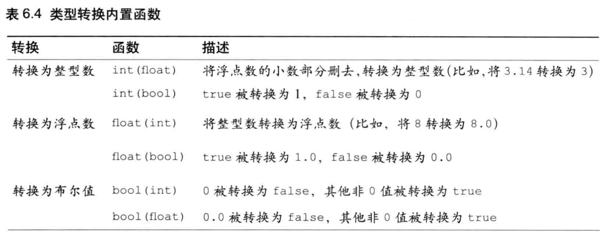

### 运算符

glsl es支持的运算符和js类似，不再赘述

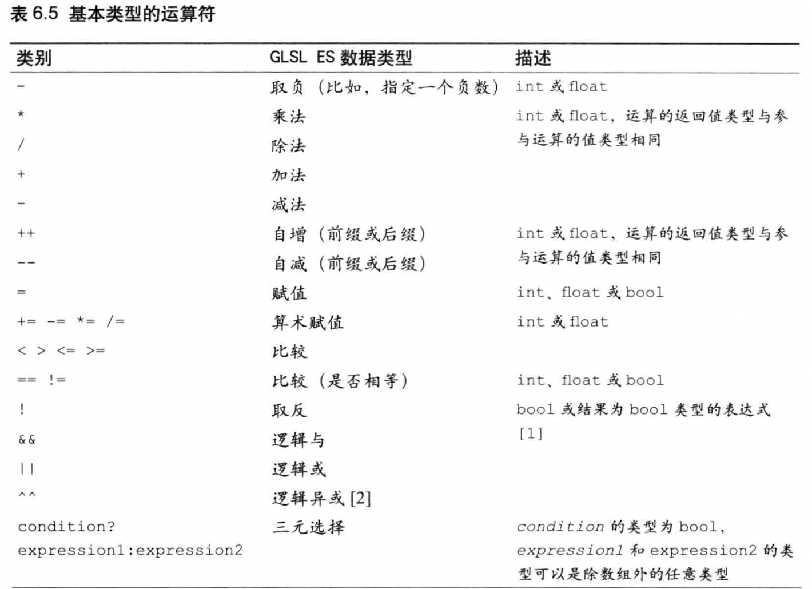

## 矢量和矩阵

GLSL ES支持矢量和矩阵类型，两种类型非常适合用于处理计算机图形。

矢量可以用于表示顶点坐标或颜色等，矩阵则将元素划分为行和列，可以用来表示变换矩阵。

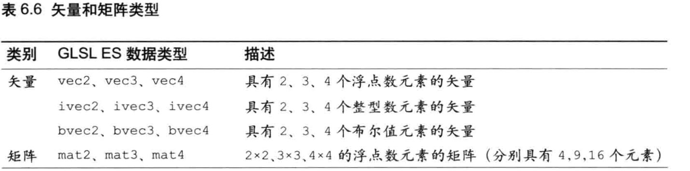

代码举例

```
vec3 position; // 三个浮点元素组成的矢量

ivec2 offset; // 两个整型元素组成的矢量

mat4 mavMatrix; // 4x4矩阵，每个元素为一个浮点数
```

### 赋值和构造

使用等号（=）来对矢量和矩阵进行赋值操作，赋值运算符左右两边的类型和元素个数必须一致。

**构造函数** ：专门用于创建指定类型的变量的函数，构造函数的名称和其创建的变量的类型名称一致。

```
vec4 position = 1.0; // 错误，vec4类型需要4个float元素个数 
vec4 position = vec4(1.0, 2.0, 3.0, 4.0) // 正确的使用构造函数
```

### 矢量构造函数

矢量构造函数提供了灵活的方式来创建矢量。

```
vec3 v3 = vec3(1.0, 0.0, 0.5); // v3为(1.0, 0.0, 0.5)
vec2 v2 = vec2(v3); // v2使用了v3的前两个元素，所以v2为(1.0, 0.0)
vec4 v4 = vec4(1.0); // v4为4个1.0，(1.0, 1.0, 1.0, 1.0)
```

第3行代码，只传入了一个参数1.0，构造出一个vec4类型的变量，构造函数会自动的将参数赋值给所有元素。

如果构造函数接收了不只一个参数，参数个数又比矢量的元素个数少，则会报错

```
vec4 v4 = vec4(1.0, 2.0); // 报错
```

用多个矢量组合成一个矢量，先使用v2的所有元素填充至v4，如果为填满，则继续使用v4的元素填充，直至填满。

```
vec4 v4b = vec4(v2, v4);
```

### 矩阵构造函数

在webgl中，要保证存储在矩阵中的元素是按照列主序排列的，而矩阵的书写方式一般是行主序。

**向矩阵构造函数传入每一个元素的数值来构造矩阵**
```
mat4 m4 = (
    1.0, 2.0, 3.0, 4.0,
    5.0, 6.0, 7.0, 8.0,
    9.0, 10.0, 11.0, 12.0,
    13.0, 14.0, 15.0, 16.0,
)
```

上述代码实际上是代表
```
(
    1.0 5.0 9.0  13.0
    2.0 6.0 10.0 14.0
    3.0 7.0 11.0 15.0
    4.0 8.0 12.0 16.0
)
```

**向矩阵构造函数传入一个或多个矢量**

```
// 使用两个vec2对象创建mat2对象
vec2 v2_1 = vec2(1.0, 3.0)
vec2 v2_2 = vec2(2.0, 4.0)
mat2 m2_1 = mat2(v2_1, v2_2); // 1.0 2.0
                              // 3.0 4.0
```

```
// 使用一个vec4对象创建mat2对象
vec4 v4 = vec4(1.0, 3.0, 2.0, 4.0);
mat2 m2_2 = mat2(v4); // 1.0 2.0
                      // 3.0 4.0
```

**向矩阵构造函数传入矢量和数值**

按照列主序使用矢量的元素值和直接传入的数值

```
mat2 m2 = mat(1.0, 3.0, v2_2); // 1.0 2.0
                               // 3.0 4.0
```

**向矩阵构造函数传入单个数值**

生成一个对象线元素都是该数值，其余为0.0的矩阵

```
mat4 m4 = mat4(1.0); // 4x4矩阵，对角线都是1.0， 其余为0.0
```

**注意点**

与矢量构造函数类似，如果传入参数大于1，又没有达到矩阵元素的数量，就会报错。

```
mat4 m4 = mat4(1.0, 2.0, 3.0); // 报错，mat4对象需要16个元素
```

### 访问元素

可以使用 点运算符(.) 或者 []运算符

### 运算符

在矢量变量名后接 点运算符(.) 加上 分量名，就可以访问矢量的元素

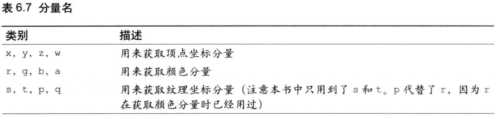

矢量可以存储顶点坐标、颜色或纹理坐标，所以任何矢量的x,r,s分量都会返回第1个分量，y,g,t都会返回第二个分量

```
vec3 v3 = vec3(1.0, 2.0, 3.0);
float f;

f = v3.x; // 1.0
f = v3.y; // 2.0
f = v3.z; // 3.0

f = v3.r; // 1.0
f = v3.s; // 1.0
```

访问超过矢量长度的分量，则会报错

```
f = v3.w; // 报错，v3赋值了3个分量，不存在w分量
```

**混合**

将多个分量名共同置于点运算符后，可以同时抽取多个分量，这个过程称为**混合**

```
vec2 v2;
v2 = v3.xy; // v2为(1.0, 2.0)
v2 = v3.yz; // v2(2.0, 3.0)
```

还可以按照不同顺序，或者跳过某个分量进行抽取，或者重复使用某个分量

```
v2 = v3.xz; // 跳过y分量
v2 = v3.zx; // 逆序并跳过y分量
v2 = v3.xx; // 重复使用x分量
```

```
vec3 v3a;
v3a = v3.xyz; // 使用v3的所有分量
v3a = v3.zyx; // 逆序使用v3所有分量
```

聚合分量名也可以用来作为赋值表达式(=)的左值

```
vec4 position = vec4(1.0, 2.0, 3.0, 4.0);
position.xw = vec2(5.0, 6.0);
```

### []运算符

使用[]运算符通过下标，也可以访问矢量或矩阵的元素

```
mat2 m2 = mat2(1.0, 2.0, 3.0, 4.0);
vec2 v2 = m2[0]; // v2为(1.0, 2.0);
float m00 = m2[0][0]; // m00为1.0
float m00 = m2[0].x // m00为1.0
```

使用[]运算符有一个限制，索引值必须为**常量索引值**，以下几种都是常量索引值

1. 整型字面量，0，1，2，3，4，5
2. 用const修饰的全局变量或局部变量，不包括函数参数。
3. 循环索引
4. 由前面三条的项组成的表达式。

```
// 正确
const int index = 0;
vec4 v4a = m4[index + 1];

// 错误
int index = 0;
vec4 v4a = m4[index + 1]; // index不是常量索引
```

### 矢量和矩阵支持的运算符

支持的运算符如下图所示
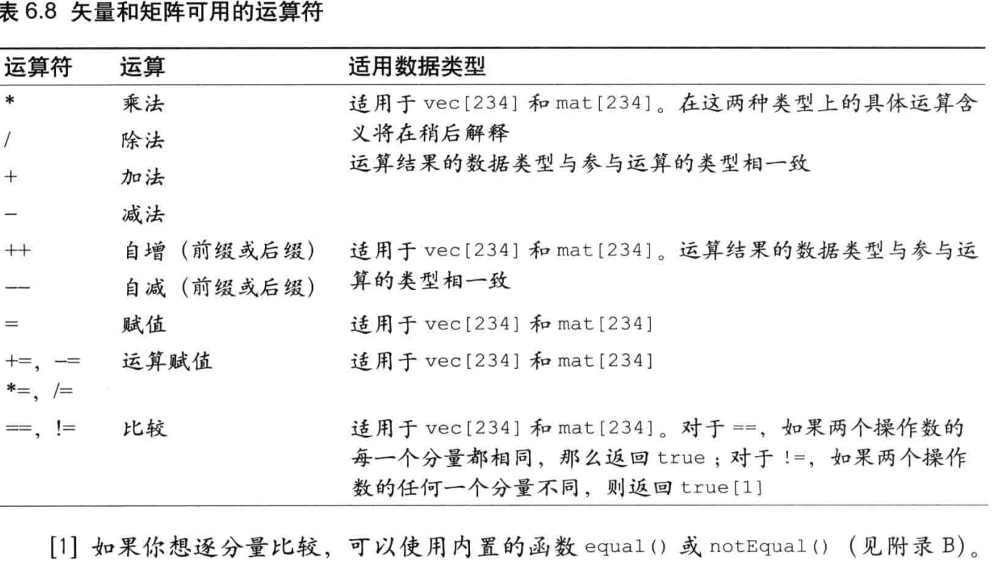

注意，>, <, >=, <= 在矢量和矩阵中不可使用，如果想比较大小，应该使用内置函数，如lessThan()等。(参见附录B)

### 矢量和浮点数的运算

```
// v3a = (1.0, 2.0, 3.0, 4.0)  f = 1.0
// 加法运算符，下面例子中就是每个分量都加1.0
// 减法、乘法、除法也是每个分量按照数值去计算每个分量即可
v3b = v3a + f; // v3b = (2.0, 3.0, 4.0, 5.0);
```

### 矢量运算

```
// v3c.x = v3a.x + v3b.x
// v3c.y = v3a.y + v3b.y
// v3c.z = v3a.z + v3b.z
// 减法、乘法、除法操作符同理
v3c = v3a + v3b;
```

### 矩阵和浮点数的运算

```
// 矩阵与数的加法，每个元素都加上f，减法、乘法、除法同理
m3b = m3a + f
```

### 矩阵右乘矢量

矩阵右乘矢量的结果是矢量，其中每个分量都是原矢量中的对应分量，呈上矩阵对应行的每个元素的积加和。

```
// v3b.x = m3a[0].x*v3a.x + m3a[1].x*v3a.y + m3a[2].x*v3a.z;
// v3b.y = m3a[0].y*v3a.x + m3a[1].y*v3a.y + m3a[2].y*v3a.z;
// v3b.z = m3a[0].z*v3a.x + m3a[1].z*v3a.y + m3a[2].z*v3a.z;
v3b = m3a * v3a;
```

### 矩阵左乘矢量

矩阵左乘矢量和右乘的结果不同，计算顺序不同

```
// v3b.x = v3a.x*m3a[0].x + v3a.y*m3a[0].y + v3a.z*m3a[0].z
// v3b.y = v3a.x*m3a[1].x + v3a.y*m3a[1].y + v3a.z*m3a[1].z
// v3b.z = v3a.x*m3a[2].x + v3a.y*m3a[2].y + v3a.z*m3a[2].z
v3b = v3a * m3a;
```

### 矩阵与矩阵相乘

矩阵与矩阵相乘

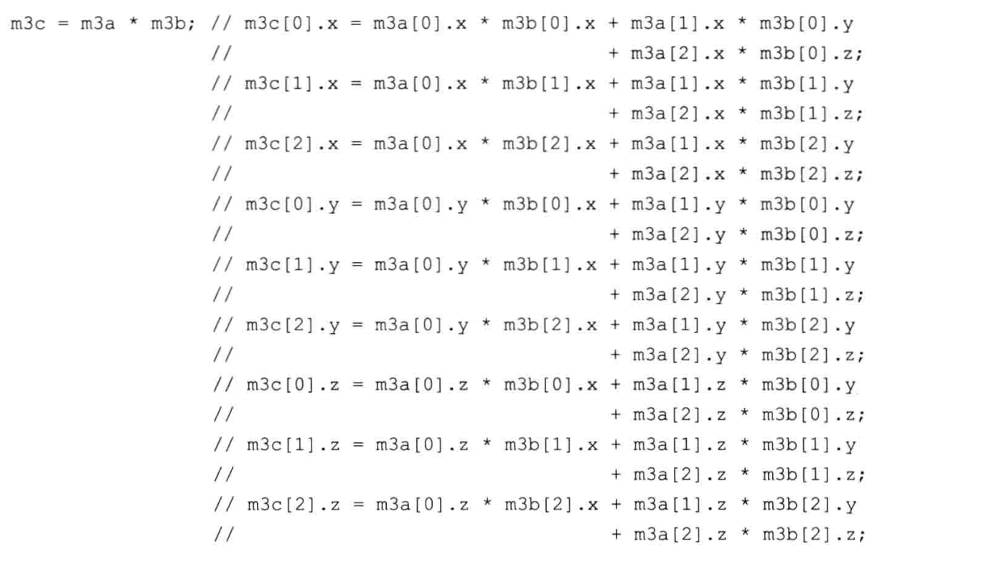

## 结构体

glsl es 支持用户自定义类型，即**结构体**，使用struct关键字去定义。

```
// 定义结构体
struct light {
    vec4 color;
    vec3 position;
}

light l1, l2; // 声明light类型变量l1和l2
```

与c语言不通，glsl es中不需要使用typedef关键字，结构体的名称会自动称为类型名

同一条语句中可以同时定义结构体light并声明变量l1
```
struct light {
    vec4 color;
    vec3 position
} l1;
```

###  赋值和构造

```
l1 = light(vec4(0.0, 1.0, 0.0, 1.0), vec3(8.0, 3.0, 0.0));
```

### 访问成员

通过.运算符加成员名，即可访问成员。

```
vec4 color = l1.color;
vec3 position = l1.position;
```

### 运算符

结构体本身只支持两种运算： 赋值(=) 和 比较 (== 和 !=)，当且仅当两个结构体变量所对应的所有成员都相等，==运算符返回true

## 数组

glsl es支持数组类型，只支持一维数组，且不支持push()和pop()等操作。

创建数组只需要在变量名后加上[]中括号和数组的长度

```
float floatArray[4];
vec4 vec2Array[2];
```

数组长度必须是大于0的整型常量表达式

1. 整型字面量(0,1,2,...)
2. const修饰的变量
3. 前述两条组成的表达式

```
int size = 4;
vec4 vec4Array[size]; // 错误
const int size1 = 4;
vec4 vec4Array[size1]; // 正确
```

**数组元素访问**

与一般js数组一样，要注意越界问题。

```
float f = vec4Array[2]
```

## 取样器(纹理)

访问纹理的时候，必须通过一种内置类型为**取样器**的uniform变量进行访问。

两种基本的取样器类型

1. sampler2D
2. samplerCube

唯一能赋值给取样器的就是纹理单元编号，必须使用gl.uniform1i()进行赋值

```
gl.uniform(u_Sampler, 0);
```

取样器类型变量收到着色器支持的纹理单元的最大数量限制

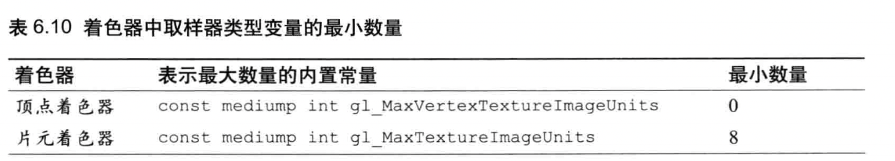

## 运算符优先级

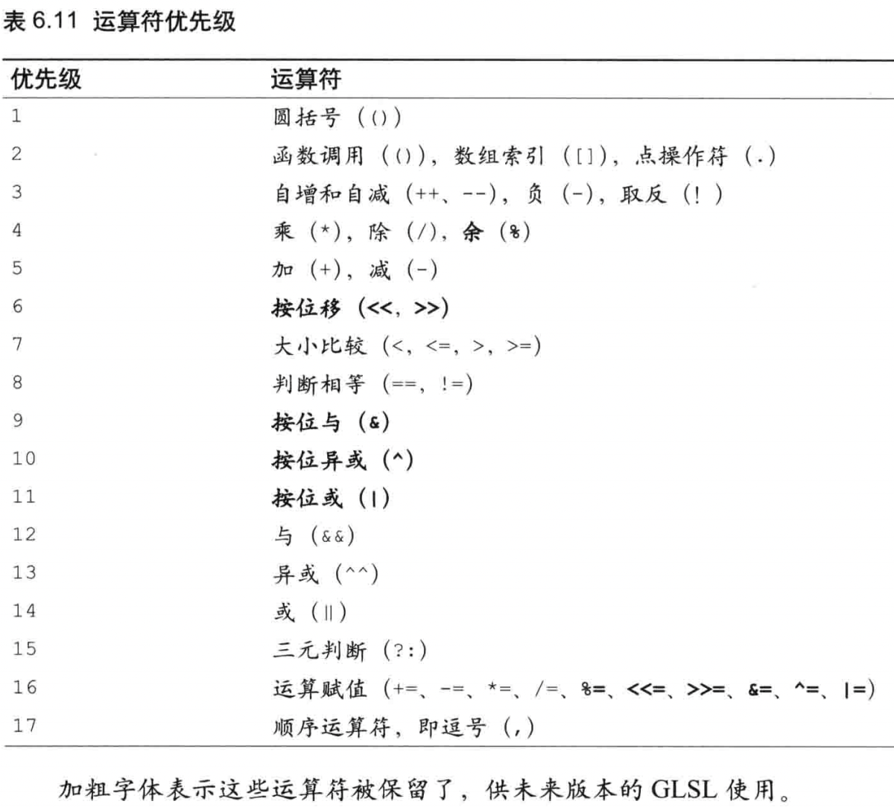

## 程序流程控制：分之和循环

与js或c的几乎无异，包括if，if-else，for，continue，break等

还有一个discard，会在第十章详细讲解。

## 函数

函数的定义方式与c语言的较为接近，但**不支持递归**，参数类型不一致也会导致报错

```
float square(float value) {
    return value * value
}

void main() {
    float x2 = square(10); // 报错，10是int型，应该是10.0
}
```

### 规范声明

如果函数定义在其调用之后，必须在调用前先进行调用声明该函数的规范，告知webgl系统函数的返回类型，参数类型等。

```
float luma(vec4); // 规范声明
void main() {
    float brightness = luma(color); // 函数定义在调用之后
}

func luma(vec4 color) {
    return 0.2126 * color.r + 0.7126 * color.g + 0.0722 * color.b;
}
```

### 参数限定词

glsl es中，可以为参数指定限定词，以控制参数的行为。

可以将参数定义为：

1. 传递给函数的
2. 将要在函数中被赋值的
3. 传递给函数，也是将要在函数中被赋值

2和3都类似于c语言中的指针，下图为参数限定词

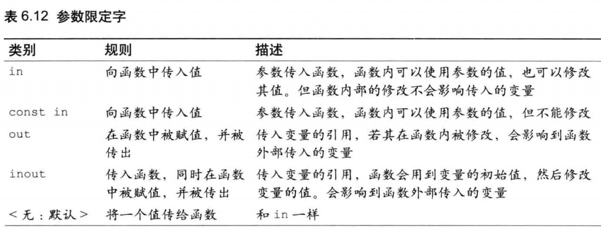

```
void luma2(in vec3 color, out float brightness) {
    brightness = .....
}

luma2(color, brightness); // 函数结果保存在brightness中

```

## 内置函数

GLSL ES提供了很多常用的内置函数，需要深入了解可以参见附录b

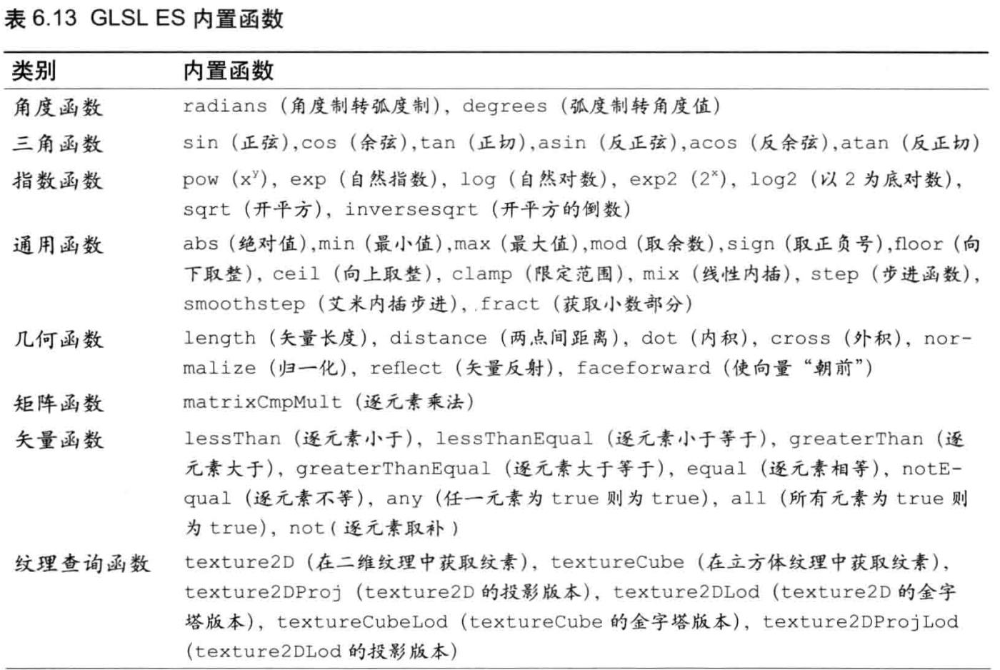

## 全局变量和局部变量

变量声明在函数外面就是全局变量，声明在函数内部就是局部变量

## 存储限定字

常用的attribute，varying，uniform限定字用于修饰变量，有时也会用const表示常量。

### const变量

使用const限定字表示该变量为常量，不允许改变，声明的同时必须对变量进行初始化。

```
const int speed = 40; // 后续如果要修改speed将会报错
const int speed1; // 没有初始化，报错
```

### attribute变量

attribute变量只能出现在顶点着色器，只能被声明为全局变量。

变量类型支持，float，vec2，vec3, vec4, mat2, mat3, mat4

顶点着色器支持的最大attribute变量的数目与设备有关，支持webgl的环境最低至少支持8个，可以通过访问内置全局常量来获取，如下图所示

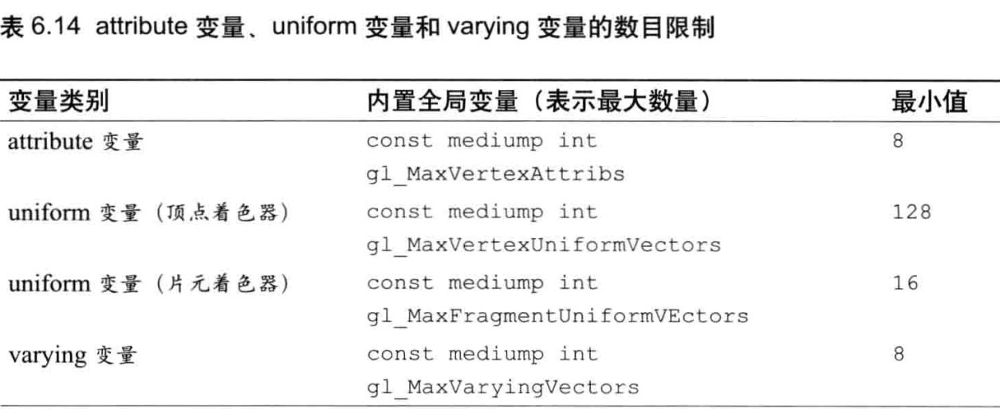

### uniform变量

可以用在顶点着色器和片元着色器，也必须是全局变量。

uniform变量是只读的，可以是除了数组或结构体之外的任意类型。

顶点着色器和片元着色器声明同样的uniform变量，那这个变量将会被共享。

与attribute一样，可以通过内置全局常量查询最大uniform变量数目。

### varying变量

也必须是全局变量，且两种着色器必须声明同名、同类型的varying变量。

varying支持类型：float, vec2, vec3, vec4, mat2, mat3, mat4

片元着色器的varying变量不是直接由顶点着色器直接赋值，而是当中经过了光栅化的过程。根据绘制的图形进行内插，再传递给片元着色器的varying变量。

与attribute一样，可以通过内置全局常量查询最大varying变量数目

## 精度限定字

用于表示每种数据具有的精度，高精度需要的开销更高。

```
#ifdef GL_ES
precision medinmp float; //  所有浮点数默认为中精度
#endif
```

webgl程序支持三种精度，如下图所示
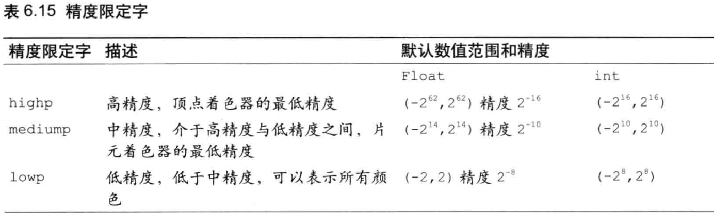

某些环境下，片元着色器可能不支持highp精度。精度数值范围和精度实际上与系统环境也有关，可以使用gl.getShaderPrecisionFormat()检查。


声明变量精度
```
// 不声明就默认中精度
#ifdef GL_ES
precision medinmp float; //  所有浮点数默认为中精度
precision highp int; //  所有int数默认为高精度
#endif
// 为单独变量声明精度
lowp float size;
highp vec4 position;
```

其他类型都有默认精度，只有float没有，如下表所示
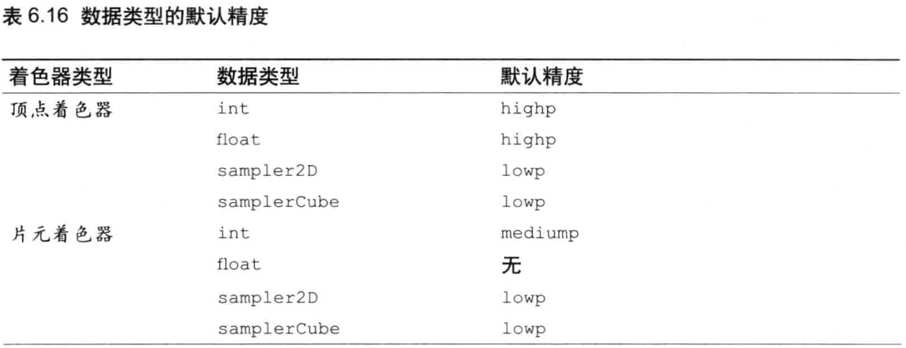

## 预处理指令

GLSL ES支持预处理指令，用于在编译之前对代码进行预处理，以#号开始

可能用到的三种预处理指令

```
#if 条件表达式
If 真，执行这里
#endif

#ifdef 某宏
执行这里
#endif

#ifndef 如没有定义某宏
执行这里
#endif
```

也可以使用#difine指令定义宏，但GLSL ES中的宏没有宏参数

```
#define 宏名 宏内容
```

使用#undef指令解除宏定义

```
#undef 宏名
```

可以使用#else配合#ifdef

```
#define NUM 100
#if NUM == 100
如果NUM==100，执行这里
#else
否则执行这里
#endif
```

预定义的内置宏

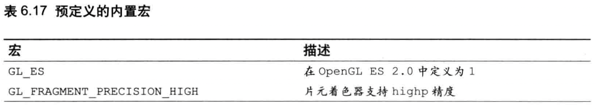

通过宏进行精度限定

```
#ifdef GL_ES
#ifdef GL_GRAGMENT_PRECISION_HIGH
    precision highp float;
#else
    precistion mediump float;
#endif
#endif
```

## 总结

本章学习了GLSL ES的特性，包括对矩阵和矢量的支持，一切设计均为了更好的设计着色器程序。


